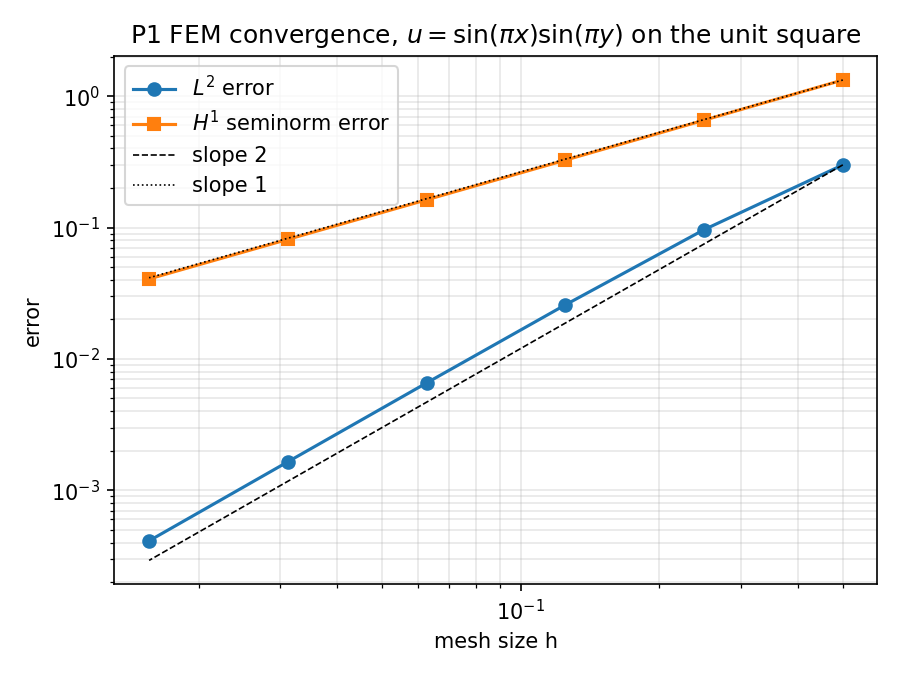

# FEM Solver for the 2D Poisson Equation (P1 elements, MATLAB/Octave)

A from-scratch finite element solver for the Poisson equation on the unit square, with uniform red mesh refinement and an empirical check of the convergence rates against finite element theory.

## Problem

```
-Δu = f   in Ω = (0,1)²
  u = 0   on ∂Ω
```

A manufactured solution is used so the exact error can be computed:

```
u(x,y) = sin(πx) sin(πy)
f(x,y) = 2π² sin(πx) sin(πy)
```

## Method

- **Weak form:** find u ∈ H₀¹(Ω) with ∫ ∇u·∇v = ∫ f v for all v ∈ H₀¹(Ω).
- **Discretisation:** continuous piecewise-linear (P1) elements on triangles. Element stiffness matrices are computed in closed form from barycentric gradients (`stima.m`).
- **Assembly:** loop over elements, add each 3×3 element matrix into the global sparse matrix. The load vector uses a one-point (centroid) quadrature rule.
- **Boundary conditions:** Dirichlet nodes are removed and the system is solved on the free nodes with MATLAB's sparse backslash.
- **Mesh:** the initial mesh is the unit square split into 2 triangles (`InitialMesh.m`). Each refinement level splits every triangle into 4 by joining edge midpoints (red refinement: `edge.m` builds the edge connectivity, `redrefine.m` creates the new nodes and elements). Level `i` has 2·4^i triangles and mesh size h = 1/2^i.

## Error measurement (`Err.m`)

- **L² error:** a 7-point quadrature rule per triangle (3 vertices, 3 edge midpoints, centroid).
- **H¹ seminorm error:** the exact gradient is evaluated at the centroid and compared with the constant FE gradient on that triangle.

## Results

Run `convergence_study.m` to reproduce (verified in MATLAB-style code under GNU Octave 8.4):

| Level | h    | Triangles | L² error | H¹ error | L² rate | H¹ rate |
| ----- | ---- | --------- | -------- | -------- | ------- | ------- |
| 1     | 1/2  | 8         | 3.00e-1  | 1.33     | -       | -       |
| 2     | 1/4  | 32        | 9.64e-2  | 6.56e-1  | 1.64    | 1.02    |
| 3     | 1/8  | 128       | 2.58e-2  | 3.26e-1  | 1.90    | 1.01    |
| 4     | 1/16 | 512       | 6.57e-3  | 1.63e-1  | 1.97    | 1.00    |
| 5     | 1/32 | 2048      | 1.65e-3  | 8.13e-2  | 1.99    | 1.00    |
| 6     | 1/64 | 8192      | 4.13e-4  | 4.06e-2  | 2.00    | 1.00    |



The observed rates approach 2 in L² and 1 in H¹, as theory predicts for P1 elements on quasi-uniform meshes (Céa's lemma plus standard interpolation estimates). Rates are computed as `log(e_i/e_{i+1}) / log(h_i/h_{i+1})`.

## Usage

```matlab
fem                 % solve on 5 refinement levels, plot FE vs exact solution
ocfem               % convergence study over 6 levels (prints rates)
convergence_study   % table + log-log plot (convergence.png)
```

## Files

| File | Purpose |
| --- | --- |
| `fem.m` | Main driver: refine, assemble, solve, compute errors, plot |
| `ocfem.m` | Convergence-rate study driver |
| `convergence_study.m` | Runs `ocfem`, prints the table, saves the plot |
| `InitialMesh.m` | Initial triangulation of the unit square |
| `edge.m`, `redrefine.m` | Edge connectivity and red refinement |
| `stima.m` | Element stiffness matrix |
| `Err.m` | L² and H¹ error computation |
| `f.m`, `ue.m`, `uxe.m`, `u_nodes.m` | Right-hand side, exact solution, exact gradient |
| `u_N.m` | Neumann data helper (not used in the Dirichlet-only runs) |
| `show.m` | Side-by-side plot of FE and exact solutions |

## Limitations

- Uniform refinement only, on the unit square, with P1 elements.
- Load vector uses a one-point quadrature rule, and the H¹ error uses a one-point rule for the exact gradient.
- Global assembly grows a sparse matrix inside a loop, which is slow for very fine meshes.

## Reference

S. C. Brenner and L. R. Scott, *The Mathematical Theory of Finite Element Methods*, Springer.
